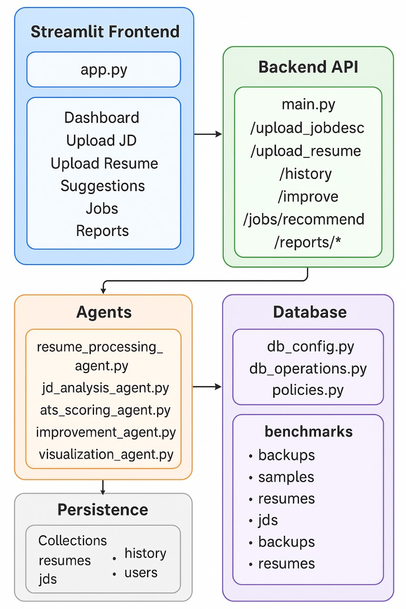

## ATS Resume Scoring System

A consistent, deterministic ATS scoring system with resume/JD parsing, actionable recommendations, and a clean Streamlit UI.

## Key Features (Required Scope)

Resume upload and parsing (PDF/DOCX/TXT)

JD upload and requirement extraction

Deterministic ATS scoring with category breakdowns and confidence interval

Recommendations: missing keywords, formatting, structure, experience alignment

Visuals: metrics, skills pie, dashboards and reports

Persistence of resumes/JDs/history and basic job recommendations

## Quick Start

Prerequisites

Python 3.10+

.env configured (see docs/setup.md)

Run locally

pip install -r requirements.txt

# start backend API (http://localhost:5000)
python main.py

# start frontend (http://localhost:8501)
streamlit run streamlit_app/app.py

## Repository Map
- [*streamlit_app/*](./streamlit_app/)
  - [app.py](./streamlit_app/app.py)
  - [components.py](./streamlit_app/components.py)
  - [styles.css](./streamlit_app/styles.css)
- [*agents/*](./agents/)
  - [resume_processing_agent.py](./agents/resume_processing_agent.py)
  - [jd_analysis_agent.py](./agents/jd_analysis_agent.py)
  - [ats_scoring_agent.py](./agents/ats_scoring_agent.py)
  - [improvement_agent.py](./agents/improvement_agent.py)
  - [visualization_agent.py](./agents/visualization_agent.py)
- [*database/*](./database/)
  - [db_config.py](./database/db_config.py)
  - [db_operations.py](./database/db_operations.py)
  - [policies.py](./database/policies.py)
- [*samples/*](./samples/)
- [*backups/*](./backups/)
- [*benchmarks.py*](./benchmarks.py)
- [*main.py*](./main.py)
- [*groq_client.py*](./groq_client.py)
- [*requirements.txt*](./requirements.txt)
- [*Dockerfile*](./Dockerfile)
- [*docker-compose.yml*](./docker-compose.yml)
- [*README.md*](./README.md)

## Documentation
- [Setup & Installation](./docs/setup.md)
- [System Architecture](./docs/architecture.md)
- [API Documentation](./docs/api.md)
- [Database Schema](./docs/schema.md)
- [Scoring Algorithm](./docs/scoring.md)
- [JD Analysis & Matching](./docs/jd_matching.md)
- [Recommendations](./docs/recommendations.md)
- [Frontend Guide](./docs/frontend.md)
- [Reports & Analytics](./docs/reports.md)
- [Troubleshooting](./docs/troubleshooting.md)
- [Performance Notes](./docs/performance.md)

## Demo

Start backend: python main.py

Start frontend: streamlit run streamlit_app/app.py

In the UI:

Upload JD (paste or file)

Upload Resume & Get Score (view metrics, pie, recommendations)

Check Dashboard/Reports

## Scoring Categories (weights)

Skills Match: 30%

Experience Relevance: 25%

Education Alignment: 15%

Format & Structure: 15%

Keyword Optimization: 15%

Determinism is ensured via fixed weights, stable parsing rules, and resume_hash tracking.

## Screenshots

## Demo

## Feature Status

✅ Resume upload and parsing

✅ JD upload and parsing

✅ Deterministic scoring with breakdowns + confidence interval

✅ Recommendations

✅ Visualizations (metrics + skills pie)

✅ History and reports